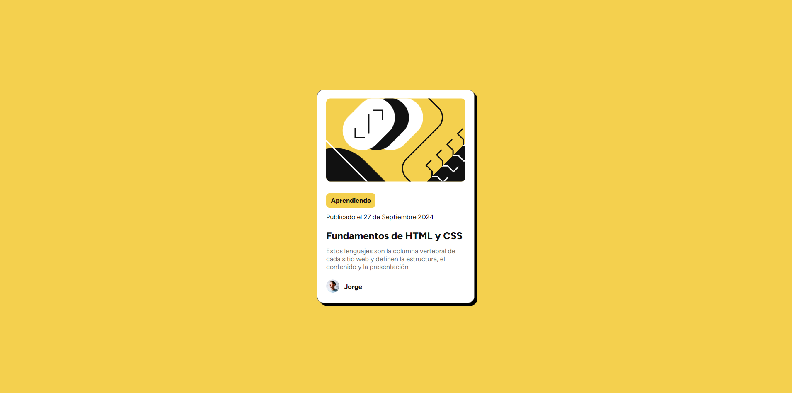

# Tarjeta de Presentación de Blog

En este pequeño proyecto diseñé una tarjeta de presentación para una publicación de un blog, utilicé las herramientas que me dio Frontend Mentor para llegar a la vista final según los objetivos establecidos.

## Contenidos

- [Previsualización](#previsualización)
  - [Screenshot](#screenshot)
  - [Links](#links)
- [Proceso](#proceso)
  - [Hecho con](#hecho-con)
## Previsualización

### Screenshot

### Links

- Sitio: [Tarjeta Presentación Blog](https://f-avalos.github.io/Tarjeta-Blog/)

## Proceso

### Hecho con

- HTML5
- CSS
- Flexbox